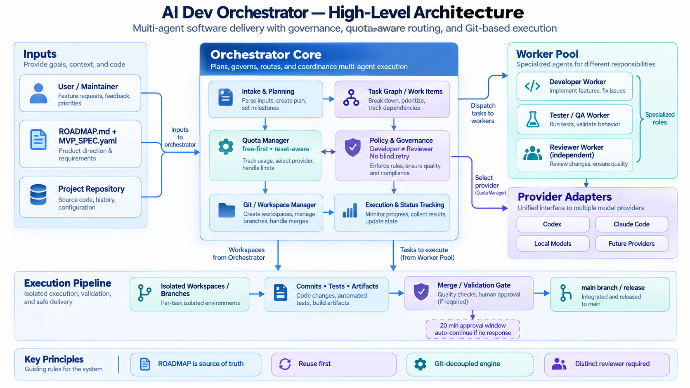

# AI Dev Orchestrator

Une couche mince de gouvernance/quota/sélection au-dessus de Ralph
Orchestrator (le CLI `ralph`) qui fait travailler plusieurs agents IA
développeurs (Claude Code, Codex CLI, Mistral Vibe) sur un vrai dépôt
Git, sous revue indépendante et QA déterministe obligatoire — jamais sur
la seule parole d'un LLM.

## Ce que ça fait

- décompose un projet en `WorkItems` gouvernés (dépendances, statut,
  reprise durable après interruption) ;
- sélectionne les workers réels (`WorkerSelector`) selon capability →
  gouvernance (DEV B ≠ DEV A) → disponibilité provider (quota réel) →
  priorité — jamais un provider forcé ;
- fait développer un WorkItem par un premier agent (DEV A), le fait
  relire et corriger par un second agent réellement indépendant (DEV
  B), puis exige un verdict QA déterministe (tests réels exécutés,
  jamais un LLM qui affirme que "ça marche") avant tout merge ;
- gouverne Git lui-même : branche dédiée par WorkItem, merge
  fast-forward-only, tag, jamais de réécriture d'historique, jamais de
  `--force`.

## État du projet

Voir [`docs/status.md`](docs/status.md) pour l'état factuel courant et
[`ROADMAP.md`](ROADMAP.md) pour le détail complet (phases, architecture,
vision cible, découpage incrémental — la source de vérité fonctionnelle
de ce projet).

**MVP 0.1 : `DONE`** (contrat d'acceptation dans
[`MVP_SPEC.yaml`](MVP_SPEC.yaml)). Gouvernance Git/PR/merge, QA gouvernée,
et le workflow par défaut ci-dessous sont implémentés, testés, et validés
par une exécution réelle de bout en bout sur un projet externe (voir
« Exemple réel » plus bas).

## Comment ça marche

### Workflow par défaut : `LEAN_FEATURE_FLOW`

Chaque WorkItem passe par un chemin nominal court — exactement **2
exécutions LLM** sur le chemin heureux (DEV A, DEV B). La QA n'est pas un
agent IA : elle est déterministe, non-LLM, ne consomme donc aucun worker
IA supplémentaire.

```
FEATURE
  ↓
DEV A — AI
  ↓
DEV B — AI corrective review  (2e développeur indépendant, pas en
  ↓                             lecture seule — il corrige et committe)
QA — deterministic             (unique, lecture seule, non-LLM)
  ↓
PASS
  ↓
MERGE + TAG + DONE

QA FAIL
  ↓
DEV FIX — AI
  ↓
QA — deterministic
  ↓ (jusqu'à 3 tentatives QA au total)
HUMAN_REVIEW_REQUIRED     (BLOCKED + TODO ajouté à la roadmap du projet
                            cible ; les autres WorkItems continuent)
```

Pas d'estimation de complexité obligatoire, pas de phase QA Test Authoring
séparée, pas de Final QA séparée — volontairement KISS/YAGNI. C'est le
**seul** workflow d'exécution de WorkItem que ce projet implémente :
l'ancien pipeline plus lourd (`GOVERNED_FULL` — Reviewer indépendant en
lecture seule, QA Test Authoring isolée, Final QA séparée) a été retiré
avant la première release publique. Voir `ROADMAP.md`, section « Chemin
nominal actuel » et son entrée datée de retrait, pour le détail complet.

### Sélection des workers et fallback provider

Un `Worker` (`config/workers.yaml`) est une identité d'exécution avec un
`provider`/`backend` **fixes** et un ou plusieurs `ExecutionProfile`
(`model`/`reasoning_effort`/`quality_tier`/`cost_rank`). `Worker !=
Provider` : plusieurs workers peuvent partager le même provider sans
jamais créer plusieurs quotas — `QuotaManager` observe un seul état par
provider.

**Un quota provider épuisé ne doit jamais forcer une attente (`WAITING`)
tant qu'un autre worker compatible, sur un provider disponible, peut
continuer.** `DEV_B.worker_id != DEV_A.worker_id` est **obligatoire** ;
un provider différent est **préféré** mais jamais requis — un repli sur
un second worker du même provider reste toujours valide. Le pool actuel
déclare au moins 2 workers indépendants par provider participant.

## Architecture

```
Project (workspace, roadmap, MVP courant)
  ↓
MVPManager (WorkItems, dépendances, handoff durable, LEAN_FEATURE_FLOW)
  ↓
WorkerSelector (capability > governance > provider availability > priority)
  ↓
RalphExecutionEngine (execution, hats, TDD, review Ralph)
  ↓
ExecutionRecord + HandoffRecord (audit + reprise durable)
```

En dessous de `WorkerSelector` :

```
Provider Adapters (probe() → ProviderState)
        ↓
    QuotaManager (multi-fenêtres, fraîcheur)
```



Voir « Vision cible du produit » dans `ROADMAP.md` pour le cycle long
terme complet, et « Chemin nominal actuel » pour ce qui s'exécute
réellement aujourd'hui par WorkItem.

## Providers supportés

| Provider | CLI/Backend | Statut |
|---|---|---|
| Anthropic | Claude Code | ✅ VALIDATED |
| OpenAI | Codex CLI | ✅ VALIDATED |
| Mistral | Vibe | ✅ VALIDATED — voir [`docs/VIBE_SPIKE.md`](docs/VIBE_SPIKE.md). Son signal de disponibilité reste `EXECUTION_PROBE_ONLY` (pas de fenêtre de quota observable), jamais fabriqué en pourcentage |
| Local | Ollama | 🔎 STUDY |

(✅ VALIDATED = intégré ET validé par une exécution réelle ; 🔎 STUDY =
candidat identifié, non intégré. Détail complet et pool de workers
actuel : `ROADMAP.md`/`docs/status.md`.)

## Démarrage rapide

Prérequis :
- Python 3.10+ ;
- Ralph CLI (`ralph`) installé et sur le `PATH` ;
- Claude Code CLI et/ou Codex CLI et/ou Mistral Vibe CLI, authentifiés
  pour les providers que vous comptez utiliser réellement ;
- `git`.

Installation :

```bash
git clone https://github.com/yannickameur/ai-dev-orchestrator.git
cd ai-dev-orchestrator
python3 -m venv .venv
source .venv/bin/activate
pip install -e ".[dev]"
```

Tests offline (aucun appel provider réel, aucun quota consommé) :

```bash
pytest
```

**Honnêteté produit** : il n'existe pas encore de commande CLI unique
pour lancer un projet gouverné — il faut aujourd'hui écrire un petit
harnais Python qui construit les stores réels (`ProjectStateStore`,
`WaitStore`, `ExecutionStore`, `GitWorkItemStore`, ...), déclare le
`Project`/`MVP`/`WorkItems`, puis appelle
`MVPManager.run_next_work_item(...)` en boucle. `scripts/run_external_project_pilot.py`
en est un exemple réel et fonctionnel (jamais lancé via `pytest` — voir
son propre docstring) ; `config/workers.yaml` déclare le pool de workers
qu'il utilise.

Pour un cas réel complet, narré et honnête (y compris une régression
découverte et corrigée), voir l'exemple ci-dessous.

## Exemple réel — Morpion Web 3D

Un vrai jeu de morpion (tic-tac-toe) web a été construit, de bout en
bout, par ce projet : roadmap → WorkItems → DEV A → DEV B → QA
déterministe (pytest + tests Node + régression navigateur Playwright) →
merge → tag — avec routage multi-provider réel, repli same-provider, et
une régression bien réelle découverte après un premier acceptance
incomplet.

Voir [`examples/morpion-web-3d/README.md`](examples/morpion-web-3d/README.md)
pour le récit complet, y compris pourquoi la reprise d'un WorkItem
`WAITING` doit utiliser un état persistant hors `/tmp`.

## État de projet / persistance

Deux choses distinctes :

- **Configuration déclarative** (`config/workers.yaml`, roadmap/MVP
  d'un projet cible) : décrit *ce qui peut être fait*, versionné,
  relu par un humain.
- **État d'exécution** (`ProjectStateStore`, `WaitStore`,
  `ExecutionStore`, `GitWorkItemStore`, `QARunStore`, ... — des SQLite
  dédiées) : décrit *ce qui a réellement été fait*, jamais reconstruit
  à la main.

Un WorkItem peut légitimement rester `WAITING` (ex. quota provider) et
doit pouvoir reprendre plus tard, par un tout autre process. Quand ce
délai peut dépasser la durée de vie d'un process (redémarrage machine
inclus), l'état d'exécution doit vivre **hors `/tmp`** — `/tmp` est
généralement vidé au redémarrage, ce qui n'est *pas* la même garantie
qu'une simple survie inter-process. Un chemin persistant typique :
`~/.local/state/ai-dev-orchestrator/projects/<project-id>/`, passé
explicitement aux constructeurs de store existants (aucun nouveau
framework de persistance). Une copie de travail purement jetable
(checkout temporaire pour reproduire un bug) peut en revanche rester
sous `/tmp` sans problème. Voir l'exemple Morpion ci-dessus pour le cas
réel qui a établi cette leçon.

## Development

Voir [`CONTRIBUTING.md`](CONTRIBUTING.md) : configuration de
l'environnement, tests, principes d'architecture (REUSE FIRST,
KISS/YAGNI, `LLM IS NOT ORACLE`, ...), règles Git.

## Security

Voir [`SECURITY.md`](SECURITY.md) pour signaler une vulnérabilité
(jamais via une issue publique).

## Contributing

Voir [`CONTRIBUTING.md`](CONTRIBUTING.md).

## License

[Apache License 2.0](LICENSE).

## Documentation

- [ROADMAP.md](ROADMAP.md) — phases, architecture, vision cible, source de vérité
- [docs/status.md](docs/status.md) — état factuel courant, court
- [MVP_SPEC.yaml](MVP_SPEC.yaml) — critères d'acceptation mesurables du MVP 0.1
- [docs/ECOSYSTEM.md](docs/ECOSYSTEM.md) — étude des projets comparables
- [docs/SPIKE_RALPH.md](docs/SPIKE_RALPH.md) — résultats du spike Phase 0.5
- [docs/VIBE_SPIKE.md](docs/VIBE_SPIKE.md) — étude de faisabilité Mistral Vibe
- [examples/morpion-web-3d/README.md](examples/morpion-web-3d/README.md) — exemple réel complet
